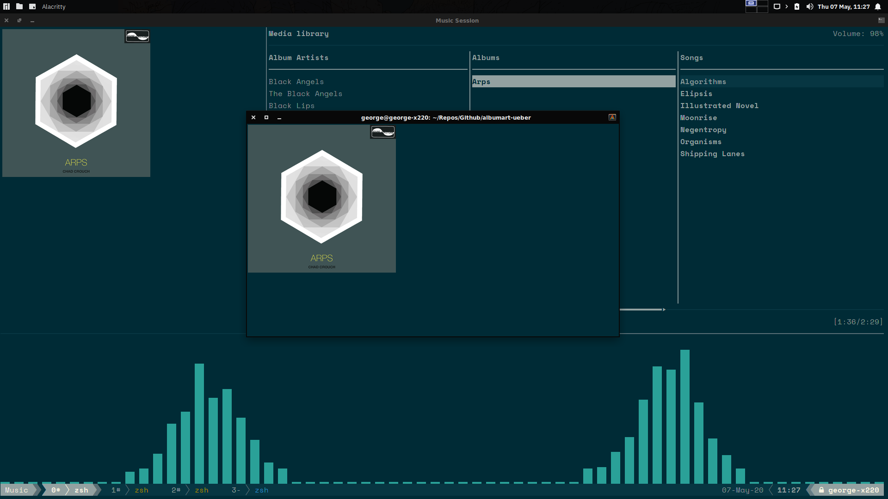

# albumart-üeber
A fun little bash project.

*Pictured album: Arps by Chad Crouch. [Music](https://www.freemusicarchive.org/music/Chad_Crouch/Arps), Licence: [Attribution-NonCommercial 3.0 Unported (CC BY-NC 3.0)](https://creativecommons.org/licenses/by-nc/3.0/)*

**Note:** in line with Überzug which this project uses as a library, this is licensed under GPLv3.

## Rationale
I was inspired by this Reddit [thread](https://www.reddit.com/r/unixporn/comments/3q4y1m/openbox_music_now_with_tmux_and_album_art/) but I quickly realised I could have something more robust if I used überzug instead of w3m.

### Use case
I like to tinker with `mpd` and this complements my favourite client, `ncmpcpp`. It works well enough on `tmux` splits to make this a viable way of displaying album artwork as part of a broader effort to make a foobar2000-like player in the terminal.

### Credits
I particularly credit these two redditors for inspiring this project:
* [u/Dylan112](https://www.reddit.com/user/Dylan112/) — also on GitHub: [dylan](https://github.com/dylanaraps), [commit](https://github.com/dylanaraps/dotfiles/commit/c89b7da3d5dba54e36629dce0ab792a61fc575ec)
* [u/drunkangel](https://www.reddit.com/user/drunkangel/) in this [comment](https://www.reddit.com/r/unixporn/comments/3q4y1m/openbox_music_now_with_tmux_and_album_art/cwdld2t/) — who suggested path-finding logic I still use in a modified form

## How to use
### Steps required
1. Obtain the script
2. Make sure that you have `ueberzug` installed
3. Make sure the script is executable
4. Play some music in `mpd`
5. Execute the script

### Currently tested terminals
* [Alacritty](https://github.com/alacritty/alacritty)
* Xfce4-terminal
* Xfce4-terminal with `tmux`

## Dependencies
* `mpd` — the music player
* `mpc` — a utility for communicating with `mpd` and checking its state
* `ueberzug` — a library for viewing images in the terminal
* `bash` — the shell for this project, mandated by `ueberzug`

## To-Dos
* [x] Add screenshots to the repo
* [x] Code clean-up
* [x] Remove hard-coded paths

## See also
* [Üeberzug](https://github.com/seebye/ueberzug)
* [Mpd](https://www.musicpd.org/)
